<!-- @import "[TOC]" {cmd="toc" depthFrom=1 depthTo=6 orderedList=false} -->

<!-- code_chunk_output -->


- [应用场景](#应用场景a-namezh-cn_topic_0000002272188165a)
- [环境准备](#环境准备a-namezh-cn_topic_0000002284876573a)
- [软件编译安装](#软件编译安装a-namezh-cn_topic_0000002237188872a)
- [部署测试机](#部署测试机a-namezh-cn_topic_0000002248974602a)
    - [准备编译环境](#准备编译环境a-namezh-cn_topic_0000002237029044a)
    - [编译安装Hyperscan](#编译安装Hyperscana-namezh-cn_topic_0000002282918349a)
    - [安装Rust](#安装rusta-namezh-cn_topic_0000002250175978a)
    - [安装MLNX驱动（CX5网卡）](#安装mlnx驱动cx5网卡a-namezh-cn_topic_0000002247879590a)
    - [编译安装DPDK](#编译安装dpdka-namezh-cn_topic_0000002248039430a)
    - [安装鲲鹏系统库](#安装鲲鹏系统库a-namezh-cn_topic_0000002284896578a)
    - [编译安装Suricata](#编译安装suricataa-namezh-cn_topic_0000002248934744a)
- [部署压力机](#部署压力机a-namezh-cn_topic_0000002248976474a)
    - [准备编译环境](#准备编译环境a-namezh-cn_topic_0000002249302714a)
    - [编译安装DPDK](#编译安装dpdka-namezh-cn_topic_0000002283870645a)
    - [编译安装Pktgen](#编译安装pktgena-namezh-cn_topic_0000002283950589a)
- [特性使用](#特性使用a-namezh-cn_topic_0000002272188161a)
    - [测试机配置](#测试机配置a-namezh-cn_topic_0000002272188149a)
    - [压力机配置](#压力机配置a-namezh-cn_topic_0000002249802882a)
    - [单核测试场景](#单核测试场景a-namezh-cn_topic_0000002237188888a)
    - [整机测试场景](#整机测试场景a-namezh-cn_topic_0000002284859661a)

<!-- /code_chunk_output -->

# Kunpeng BoostKit 25.1.0 数据分流使能套件 Suricata部署指南
## 应用场景<a name="ZH-CN_TOPIC_0000002272188165"></a>

在网安IDS/IPS场景使用，对下调用Hyperscan等加速库做规则匹配。
## 环境准备<a name="ZH-CN_TOPIC_0000002284876573"></a>

准备两台服务器，一台压力机（使用pktgen发包），一台测试机（收包测试Suricata性能）。

**图 1**  测试组网<a name="fig1682118211216"></a>  
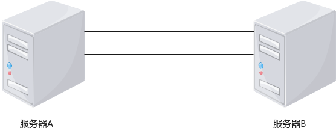

假设服务器A为压力机，服务器B为测试机。

需要在服务器B上安装足够带宽的网卡，便于测试整机性能，可使用多张网卡，推荐总带宽为300Gbps-400Gbps。

同时，在服务器A上安装相同网口数量，带宽大于等于服务器B的网卡，与服务器B上的网口一一对应起来。两台服务器间所有网口均使用光纤直连。

本文使用的服务器具体配置可参考[表1](#table341811344247)和[表2](#table1765333119315)。

**表 1**  测试机配置

<a name="table341811344247"></a>
<table><tbody><tr id="row9419234142411"><th class="firstcol" valign="top" width="50%" id="mcps1.2.3.1.1"><p id="p114199346248"><a name="p114199346248"></a><a name="p114199346248"></a>服务器</p>
</th>
<td class="cellrowborder" valign="top" width="50%" headers="mcps1.2.3.1.1 "><p id="p17419113492411"><a name="p17419113492411"></a><a name="p17419113492411"></a>S920X20</p>
</td>
</tr>
<tr id="row1441963419249"><th class="firstcol" valign="top" width="50%" id="mcps1.2.3.2.1"><p id="p104191534102410"><a name="p104191534102410"></a><a name="p104191534102410"></a>OS</p>
</th>
<td class="cellrowborder" valign="top" width="50%" headers="mcps1.2.3.2.1 "><p id="p16419734132419"><a name="p16419734132419"></a><a name="p16419734132419"></a>openEuler 22.03 LTS SP4</p>
</td>
</tr>
<tr id="row14194346242"><th class="firstcol" valign="top" width="50%" id="mcps1.2.3.3.1"><p id="p174197341247"><a name="p174197341247"></a><a name="p174197341247"></a>Kernel版本</p>
</th>
<td class="cellrowborder" valign="top" width="50%" headers="mcps1.2.3.3.1 "><p id="p18419113432417"><a name="p18419113432417"></a><a name="p18419113432417"></a>5.10.0-216.0.0.115.oe2203sp4.aarch64</p>
</td>
</tr>
<tr id="row2041918345241"><th class="firstcol" valign="top" width="50%" id="mcps1.2.3.4.1"><p id="p104191134132414"><a name="p104191134132414"></a><a name="p104191134132414"></a>处理器</p>
</th>
<td class="cellrowborder" valign="top" width="50%" headers="mcps1.2.3.4.1 "><p id="p15419143462418"><a name="p15419143462418"></a><a name="p15419143462418"></a>2*鲲鹏920 7270Z处理器</p>
</td>
</tr>
<tr id="row147916502254"><th class="firstcol" valign="top" width="50%" id="mcps1.2.3.5.1"><p id="p7480650162512"><a name="p7480650162512"></a><a name="p7480650162512"></a>内存</p>
</th>
<td class="cellrowborder" valign="top" width="50%" headers="mcps1.2.3.5.1 "><p id="p1748017509251"><a name="p1748017509251"></a><a name="p1748017509251"></a>16*32G 4800MHz</p>
</td>
</tr>
<tr id="row47758239262"><th class="firstcol" valign="top" width="50%" id="mcps1.2.3.6.1"><p id="p0775112318268"><a name="p0775112318268"></a><a name="p0775112318268"></a>网卡</p>
</th>
<td class="cellrowborder" valign="top" width="50%" headers="mcps1.2.3.6.1 "><p id="p1677512332616"><a name="p1677512332616"></a><a name="p1677512332616"></a>4*25GE SP680 * 3</p>
</td>
</tr>
</tbody>
</table>

**表 2**  压力机配置

<a name="table1765333119315"></a>
<table><tbody><tr id="row66541031123116"><th class="firstcol" valign="top" width="49.95%" id="mcps1.2.3.1.1"><p id="p465443123111"><a name="p465443123111"></a><a name="p465443123111"></a>服务器</p>
</th>
<td class="cellrowborder" valign="top" width="50.05%" headers="mcps1.2.3.1.1 "><p id="p196541631153111"><a name="p196541631153111"></a><a name="p196541631153111"></a>鲲鹏服务器</p>
</td>
</tr>
<tr id="row15654431173118"><th class="firstcol" valign="top" width="49.95%" id="mcps1.2.3.2.1"><p id="p1665419317314"><a name="p1665419317314"></a><a name="p1665419317314"></a>OS</p>
</th>
<td class="cellrowborder" valign="top" width="50.05%" headers="mcps1.2.3.2.1 "><p id="p1365453115317"><a name="p1365453115317"></a><a name="p1365453115317"></a>openEuler 24.03 LTS SP1</p>
</td>
</tr>
<tr id="row1665414314311"><th class="firstcol" valign="top" width="49.95%" id="mcps1.2.3.3.1"><p id="p1865423114312"><a name="p1865423114312"></a><a name="p1865423114312"></a>Kernel版本</p>
</th>
<td class="cellrowborder" valign="top" width="50.05%" headers="mcps1.2.3.3.1 "><p id="p186541731103118"><a name="p186541731103118"></a><a name="p186541731103118"></a>6.6.0-72.0.0.76.oe2403sp1.aarch64</p>
</td>
</tr>
<tr id="row196541731103110"><th class="firstcol" valign="top" width="49.95%" id="mcps1.2.3.4.1"><p id="p3654103118314"><a name="p3654103118314"></a><a name="p3654103118314"></a>处理器</p>
</th>
<td class="cellrowborder" valign="top" width="50.05%" headers="mcps1.2.3.4.1 "><p id="p6654163183110"><a name="p6654163183110"></a><a name="p6654163183110"></a>2*鲲鹏920 7260T处理器</p>
</td>
</tr>
<tr id="row12654193113112"><th class="firstcol" valign="top" width="49.95%" id="mcps1.2.3.5.1"><p id="p365483112316"><a name="p365483112316"></a><a name="p365483112316"></a>内存</p>
</th>
<td class="cellrowborder" valign="top" width="50.05%" headers="mcps1.2.3.5.1 "><p id="p10654153118317"><a name="p10654153118317"></a><a name="p10654153118317"></a>8*32G 2933MHz</p>
</td>
</tr>
<tr id="row765453115315"><th class="firstcol" valign="top" width="49.95%" id="mcps1.2.3.6.1"><p id="p765453123114"><a name="p765453123114"></a><a name="p765453123114"></a>网卡</p>
</th>
<td class="cellrowborder" valign="top" width="50.05%" headers="mcps1.2.3.6.1 "><p id="p198216713416"><a name="p198216713416"></a><a name="p198216713416"></a>4*25GE SP680 * 2 + 2*25GE CX5 * 2</p>
</td>
</tr>
</tbody>
</table>

> **说明：** 
>1.  测试机网卡的插法建议按照CPU平均分配，防止跨片绑定核心的情况。
>2.  网卡的传输速率会受到PCIe速率限制，需确认网卡所在PCIe槽位速率大于网卡速率。
>    **图 2**  PCIe速率计算方法<a name="fig32601332172420"></a>  
>    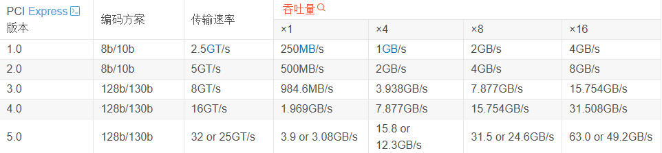


## 软件编译安装<a name="ZH-CN_TOPIC_0000002237188872"></a>

### 部署测试机<a name="ZH-CN_TOPIC_0000002248974602"></a>

#### 准备编译环境<a name="ZH-CN_TOPIC_0000002237029044"></a>

准备服务器的操作系统，并安装好相关编译工具。

1.  下载openEuler 22.03 LTS SP4镜像包并进行虚拟化安装。下载地址：[https://dl-cdn.openeuler.openatom.cn/openEuler-22.03-LTS-SP4/ISO/aarch64/](https://dl-cdn.openeuler.openatom.cn/openEuler-22.03-LTS-SP4/ISO/aarch64/)。
2.  安装编译工具。

    ```
    yum install -y meson gcc gcc-c++ make cmake ninja-build
    ```

    若出现如下报错，在配置文件“/etc/yum.conf“添加配置：**sslverify=false**后重试即可。

    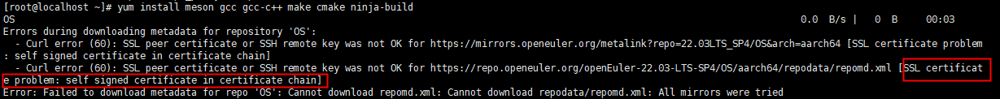

    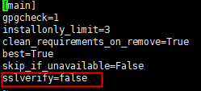

3.  安装依赖。

    ```
    yum install -y libpcap libpcap-devel pcre pcre-devel libyaml libyaml-devel file-devel zlib zlib-devel jansson jansson-devel nss nss-devel libcap-ng libcap-ng-devel libnet libnet-devel libnetfilter_queue libnetfilter_queue-devel lua lua-devel tar cargo libibverbs rdma-core-devel infiniband-diags libibumad libnl3-devel librdmacm rdma-core git
    ```

4.  关闭防火墙。

    ```
    systemctl stop firewalld.service
    ```

5.  停止防火墙。

    ```
    systemctl disable firewalld.service
    ```

6.  查看防火墙状态。

    ```
    systemctl status firewalld.service
    ```

    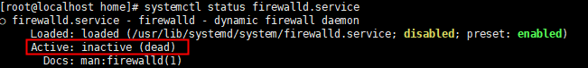


#### 编译安装Hyperscan<a name="ZH-CN_TOPIC_0000002282918349"></a>

本章节主要描述如何编译与安装Hyperscan。

1.  配置编译环境。
    1.  安装Ragel。
        1.  获取Ragel 6.10源码包。

            ```
            wget http://www.colm.net/files/ragel/ragel-6.10.tar.gz --no-check-certificate
            ```

        2.  编译安装。

            ```
            tar -xzf ragel-6.10.tar.gz
            cd ./ragel-6.10
            ./configure
            make -j
            make install
            ```

        3.  检查是否安装成功。

            ```
            ragel -v
            ```

            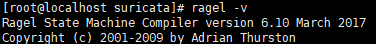

    2.  配置Boost。
        1.  获取Boost 1.87源码包。

            ```
            wget https://archives.boost.io/release/1.87.0/source/boost_1_87_0.tar.gz --no-check-certificate
            ```

        2.  <a name="li1374215120154"></a>解压源码。

            ```
            tar -zxf boost_1_87_0.tar.gz
            ```

    3.  下载PCRE。

        ```
        wget https://sourceforge.net/projects/pcre/files/pcre/8.43/pcre-8.43.tar.gz --no-check-certificate
        tar -zxf pcre-8.43.tar.gz
        ```

    4.  安装SQLite。
        1.  安装SQLite及开发套件。

            ```
            yum install -y sqlite sqlite-devel
            ```

        2.  安装完成后使用以下命令验证开发套件是否配置成功。

            ```
            pkg-config --libs sqlite3
            ```

            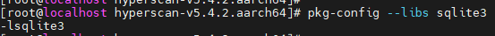

2.  编译Hyperscan。
    1.  获取Hyperscan源码包。

        ```
        wget https://gitee.com/kunpengcompute/hyperscan/archive/refs/tags/v5.4.2.aarch64.tar.gz --no-check-certificate
        tar -zxf hyperscan-v5.4.2.aarch64.tar.gz
        ```

        > **说明：** 
        >若出现如下报错建议将源码包下载到本地传入服务器再解压。
        >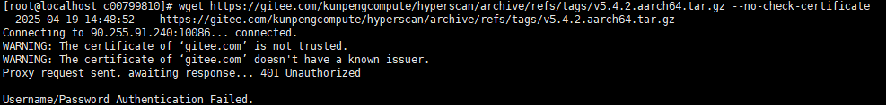

    2.  添加Boost头文件，其中_\{boost\_path\}_需替换为绝对路径。

        ```
        cd hyperscan-v5.4.2.aarch64
        ln -s {boost_path}/boost include/boost
        ```

        > **说明：** 
        >编译依赖Boost头文件，_\{boost\_path\}_即[1.b.ii](#li1374215120154)中boost\_1\_87\_0.tar.gz解压后的全路径，此处boost\_path推荐使用绝对路径。

    3.  添加PCRE依赖库。
        1.  将解压后的pcre-8.43文件夹拷贝到Hyperscan源码目录下并重命名为pcre文件夹。

            ```
            cd ..
            cp -rf ./pcre-8.43 hyperscan-v5.4.2.aarch64/pcre
            ```

        2.  编辑pcre/CMakeLists.txt。
            1.  打开“hyperscan-v5.4.2.aarch64/pcre/CMakeLists.txt“。

                ```
                vi hyperscan-v5.4.2.aarch64/pcre/CMakeLists.txt
                ```

            2.  按“i“进入编辑模式，将拷贝后的“pcre/CMakeLists.txt”文件中第77行注释掉，如下所示。

                ```
                CMAKE_MINIMUM_REQUIRED(VERSION 2.8.0) 
                #CMAKE_POLICY(SET CMP0026 OLD)
                ```

                > **说明：** 
                >CMakeLists.txt文件中第77行命令在CMake低于2.8.1及以下的版本下无法识别且不影响功能，故需要将其注释掉。也可以通过升级系统CMake版本为3.0及以上解决上述CMAKE\_POLICY命令无法识别问题。

            3.  按“Esc“键，输入**:wq!**，按“Enter“键保存并退出编辑。

    4.  源码编译安装。
        1.  进入Hyperscan源码目录，创建“build“目录。

            ```
            cd hyperscan-v5.4.2.aarch64
            mkdir -p build
            cd build
            ```

        2.  编译并安装。

            编译源码动态库，在执行编译命令中增加生成动态库编译选项：**-DBUILD\_SHARED\_LIBS=ON**，编译选项默认为release模式。

            ```
            cmake .. -DBUILD_SHARED_LIBS=ON
            make -j
            make install
            ```


#### 安装Rust<a name="ZH-CN_TOPIC_0000002250175978"></a>

Suricata编译需要用到Rust，本章节主要描述如何安装Rust。

1.  获取源码包。
    1.  从[https://forge.rust-lang.org/infra/other-installation-methods.html\#rustup](https://forge.rust-lang.org/infra/other-installation-methods.html#rustup)获取aarch64-unknown-linux-gnu离线安装包，并传入服务器。

        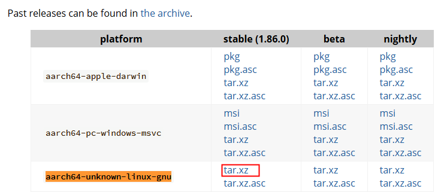

    2.  解压并进入rust目录。

        ```
        tar -xvf rust-1.86.0-aarch64-unknown-linux-gnu.tar.xz
        cd rust-1.86.0-aarch64-unknown-linux-gnu
        ```

2.  运行安装脚本。

    ```
    ./install.sh
    ```

3.  验证是否安装成功。

    ```
    rustc --version
    ```

    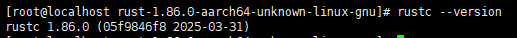


#### 安装MLNX驱动（CX5网卡）<a name="ZH-CN_TOPIC_0000002247879590"></a>

测试环境中如有使用Mellanox CX5网卡，该网卡不需要额外通过DPDK纳管，但需要更新MLNX驱动。

1.  点击[https://network.nvidia.com/products/infiniband-drivers/linux/mlnx\_ofed/](https://network.nvidia.com/products/infiniband-drivers/linux/mlnx_ofed/)获取驱动。
2.  在界面中选择相匹配的OS及架构，版本（Version）则根据网卡进行选择，CX-4选择5.8版本，CX5选择23.10版本。确定后下载tgz包。

    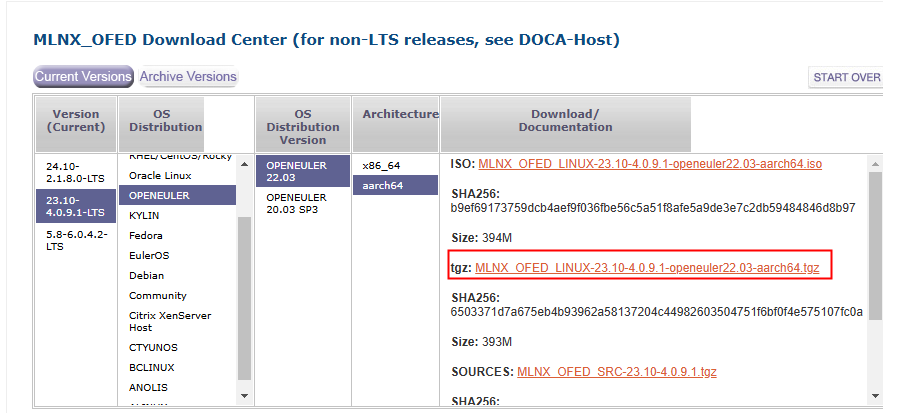

3.  安装驱动。
    1.  解压并进入目录。

        ```
        tar -zxf MLNX_OFED_LINUX-23.10-4.0.9.1-openeuler22.03-aarch64.tgz
        cd MLNX_OFED_LINUX-23.10-4.0.9.1-openeuler22.03-aarch64
        ```

    2.  安装依赖，卸载相关冲突依赖。

        ```
        yum install -y autoconf automake gdb-headless patch lsof libtool rpm-build kernel-devel-$(uname -r) tk
        yum remove rdma-core-devel 
        ```

        > **说明：** 
        >其中，Kernel版本需要和当前操作系统内核版本一致，即与**uname -r**获取的结果一致。

    3.  安装驱动。

        ```
        ./mlnxofedinstall --dpdk --add-kernel-support --skip-repo
        ```

        返回如下信息代表安装成功。

        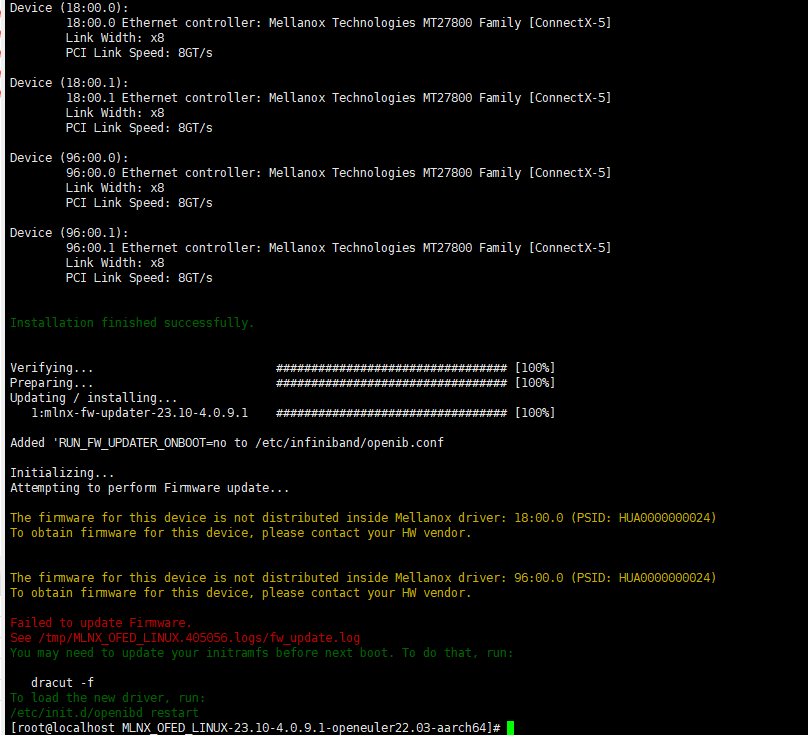

    4.  重新加载驱动。

        ```
        /etc/init.d/openibd restart --force
        ```


#### 编译安装DPDK<a name="ZH-CN_TOPIC_0000002248039430"></a>

Suricata借助DPDK进行网络流量收包，需提前安装，本章节主要描述如何编译安装DPDK。

1.  下载DPDK发布版：

    ```
    wget https://fast.dpdk.org/rel/dpdk-21.11.9.tar.xz --no-check-certificate
    tar -Jxf dpdk-21.11.9.tar.xz
    ```

2.  为兼容sp600系列网卡，打入hinic3补丁
    1.  下载hinic3补丁

        ```
        git clone [https://gitee.com/openeuler/dpdk.git](https://gitee.com/openeuler/dpdk.git) -b hinic3
        ```

    2.  初始化dpdk发布版git仓

        ```
        cd dpdk-stable-21.11.9
        git init
        git add .
        git commit -m "init"
        git log
        ```

        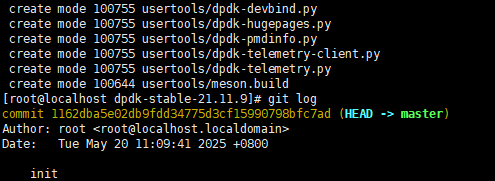

    3.  打入补丁到dpdk发布版

        ```
        git am ../dpdk/DPDK_21.11_patch/000*
        git log
        ```

        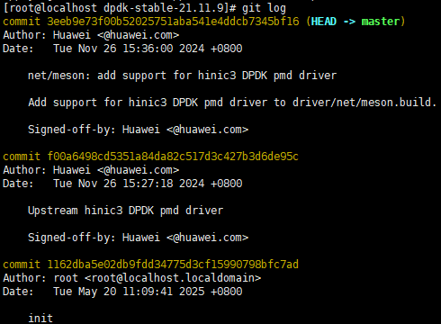

3.  编译安装，指定动态编译并追加dpdk-l3fwd测试工具编译。

    ```
    yum install -y python3-pyelftools numactl-devel
    meson -Ddefault_library=shared -Dexamples=l3fwd build
    ninja -C build
    cd build && meson install
    ```

4.  校验是否安装成功。

    ```
    export PKG_CONFIG_PATH=/usr/local/lib64/pkgconfig:$PKG_CONFIG_PATH
    pkg-config --modversion libdpdk
    ```

    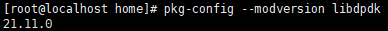


#### 安装鲲鹏系统库<a name="ZH-CN_TOPIC_0000002284896578"></a>

鲲鹏系统库，简称KSL（Kunpeng System Library）是华为提供的基于鲲鹏平台优化的高性能系统函数库，提供了鲲鹏平台上x86指令迁移，内存分配，多线程，编解码，字符串匹配等能力，通过充分发挥鲲鹏硬件优势，对比原生实现有一定的性能和易用性提升。

1.  获取软件包（BoostKit-ksl_2.5.1.zip），解压并传入服务器中。

    [https://www.hikunpeng.com/developer/boostkit/library/detail?subtab=kpglibc](https://www.hikunpeng.com/developer/boostkit/library/detail?subtab=kpglibc)

2.  安装KSL。

    ```
    rpm -ivh boostkit-ksl-2.5.0-1.aarch64.rpm
    source /etc/profile
    ```

    > **说明：** 
    >后续Suricata的安装中，会通过编译选项使用KSL安装好的库，以实现加速的效果。下图为KSL的组成部分。
    >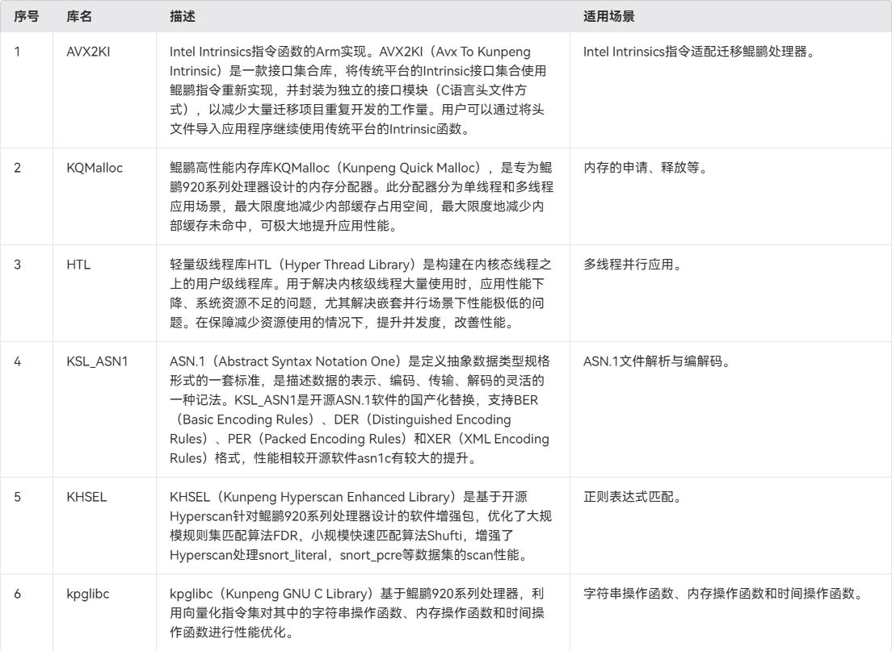


#### 编译安装Suricata<a name="ZH-CN_TOPIC_0000002248934744"></a>

本章节主要描述Suricata的编译安装步骤。

1.  源码获取。

    ```
    git config --global http.sslVerify "false"
    git clone https://gitee.com/kunpeng_compute/suricata.git
    cd suricata
    git checkout suricata-7.0.8-dadk
    ```

2.  编译安装。
    1.  生成configure文件。

        ```
        yum install -y pcre2-devel libtool
        export PKG_CONFIG_PATH=/usr/local/lib64/pkgconfig
        ./scripts/bundle.sh
        ./autogen.sh
        ```

    2.  配置cargo源。

        ```
        vi ~/.cargo/config
        ```

    3.  在config文件中录入以下内容。

        ```
        [source.crates-io]
        replace-with = 'tuna'
        
        [source.tuna]
        registry = "https://mirrors.tuna.tsinghua.edu.cn/git/crates.io-index.git"
        
        [net]
        git-fetch-with-cli = true
        
        [http]
        check-revoke=false
        ```

    4.  安装cbindgen。

        ```
        cargo install --force cbindgen
        export PATH=$PATH:/root/.cargo/bin
        ```
        若遇到以下报错。

        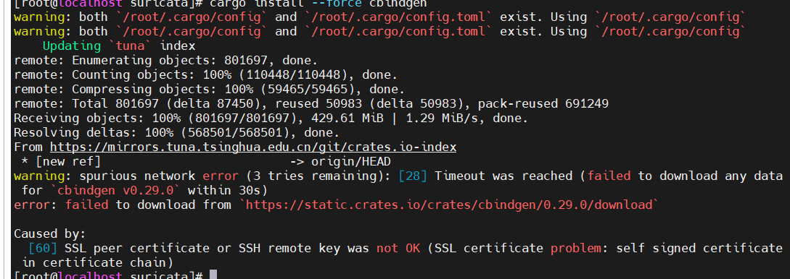

        应添加证书解决，在cargo源中添加证书路径。以下为示例，用户需替换为实际路径

        ```
        cainfo = "/home/xx.crt"
        ```


    5.  执行configure文件，编译选项使能了[安装鲲鹏系统库](#安装鲲鹏系统库)安装的ksl中的glibc, htl, kqmalloc三个库。

        ```
        AR=gcc-ar NM=gcc-nm RANLIB=gcc-ranlib CFLAGS="-O3 -flto -flto-partition=one -fccmp2 -fsigned-char -mtune=tsv110 -march=armv8-a+crc+lse -I/usr/local/ksl/include -L/usr/local/ksl/lib -lkpglibc -I/usr/local/ksl/include -L/usr/local/ksl/lib -lhtl -I/usr/local/ksl/include -L/usr/local/ksl/lib -lkqmalloc -Wl,-q " ./configure  --enable-hyperscan  --enable-hugepage --enable-dpdk --enable-detection  --sysconfdir=/etc --localstatedir=/var   --with-libhs-libraries="{hyperscan_path}/build/lib -lhs -lhs_runtime" --with-libhs-includes="{hyperscan_path}/include -I{hyperscan_path}/src"
        ```

        > **说明：** 
        >Hyperscan库路径与头文件路径需替换为实际安装路径。

    6.  <a name="li16263431193829">执行编译安装

        ```
        make -j
        make install
        make install-conf
        ```

        最后一条命令会展示安装之后的配置文件所在的位置

        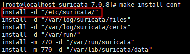


### 部署压力机<a name="ZH-CN_TOPIC_0000002248976474"></a>

#### 准备编译环境<a name="ZH-CN_TOPIC_0000002249302714"></a>

openEuler 22.03 LTS SP4与openEuler 24.03 LTS SP1均可，案例中使用的是openEuler 24.03 LTS SP1。

安装编译工具。

```
yum install -y meson gcc gcc-c++ make cmake ninja-build
```


#### 编译安装DPDK<a name="ZH-CN_TOPIC_0000002283870645"></a>

Pktgen需要借助DPDK进行网络流量的发包，需提前安装，本章节主要描述如何编译安装DPDK。

1.  获取依赖。

    此处以openEuler 24.03 LTS SP1为例，安装依赖包。

    ```
    yum install -y gcc python3  python3-pyelftools numactl-devel 
    ```

2.  编译安装。

    参考[编译安装DPDK](#编译安装DPDK)，如果压力机需使用CX5网卡，则需先按照[安装MLNX驱动（CX5网卡）](#安装MLNX驱动（CX5网卡）)操作，再进行DPDK的编译。


#### 编译安装Pktgen<a name="ZH-CN_TOPIC_0000002283950589"></a>

本章节主要描述如何编译安装Pktgen。

1.  获取依赖。

    ```
    yum install -y lua lua-devel libpcap libpcap-devel
    ```

2.  源码编译安装Pktgen。
    1.  获取源码。

        ```
        wget https://github.com/pktgen/Pktgen-DPDK/archive/refs/tags/pktgen-21.11.0.tar.gz --no-check-certificate
        tar -xf pktgen-21.11.0.tar.gz
        ```

    2.  编译安装。

        ```
        cd Pktgen-DPDK-pktgen-21.11.0
        export PKG_CONFIG_PATH=/usr/local/lib64/pkgconfig
        meson -Denable_lua=true build
        ninja -C build
        cd build && meson install
        ```

    3.  编译过程中（ninja -C build）可能遇到的报错与处理方案。
        -   问题1：代码中已规避释放后再使用内存的情况，但编译器可能仍识别为异常报错，为正常编译屏蔽此类报错。

            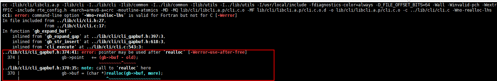

            解决方案：编辑build.ninja，添加如下内容。

            ```
            vi build/build.ninja
            -Wno-use-after-free
            ```

            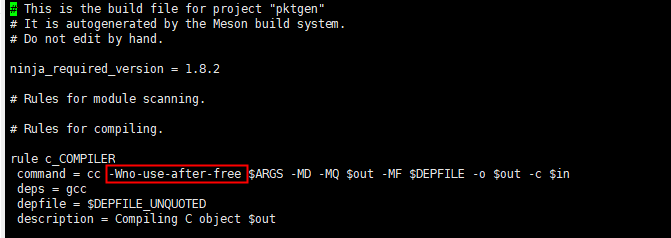

        -   问题2：\_\_rte\_cache\_aligned要求结构体大小是DPDK中定义的宏RTE\_CACHE\_LINE\_SIZE的整数倍，在dpdk-21.11中这个值为128，而pktgen-21.11中该结构体latsamp\_stats\_t的大小是40832，需要添加填充字段以达到128的整数倍。

            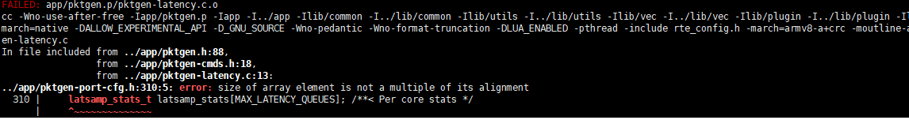

            解决方案：编辑对应文件，按如下方式修改，添加填充字段uint8\_t padding\[64\]。

            ```
            vi app/pktgen-port-cfg.h
            ```

            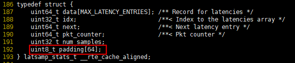

        -   问题3：文件打开和关闭使用的函数不统一。

            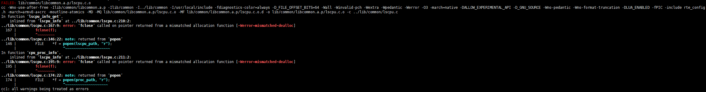

            解决方案：按提示编辑报错文件，将fclose改成pclose。

        -   问题4：无效的判断条件。

            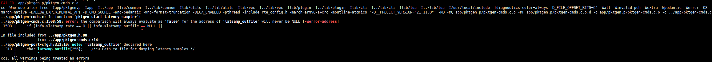

            解决方案：编辑对应文件，去掉报错的冗余条件。

            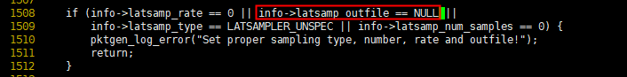


## 特性使用<a name="ZH-CN_TOPIC_0000002272188161"></a>

### 测试机配置<a name="ZH-CN_TOPIC_0000002272188149"></a>

在运行suricata-dpdk进行收包解析之前，需要提前进行相关配置，包括：大页内存配置、BIOS选项调优、Suricata配置。

1.  大页内存配置。使用DPDK需要配置大页内存。
    1.  检查OS页表大小，配置大页内存。

        ```
        getconf PAGESIZE
        ```

        4K页表推荐配置1G大页内存，在“/boot/efi/EFI/openEuler/grub.cfg“中添加以下内容，保存后重启生效。该配置会设置128个1G的大页内存，并均分在各个NUMA上。

        ```
        vi /boot/efi/EFI/openEuler/grub.cfg
        ```

        ```
        default_hugepagesz=1G hugepagesz=1G hugepages=128 iommu.passthrough=1
        ```

        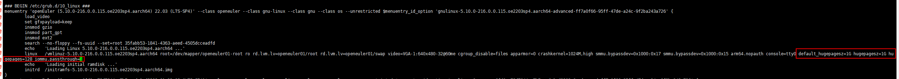

    2.  重启后检查大页内存配置是否生效。

        ```
        dpdk-hugepages.py -s
        ```

        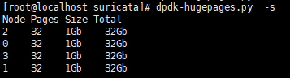

2.  BIOS配置。

    重启服务器，进入BIOS界面，具体可参见[《TaiShan 服务器 BIOS 参数参考（鲲鹏920处理器）》](https://support.huawei.com/enterprise/zh/doc/EDOC1100088653/a77cbc34)中的“进入BIOS界面”相关内容。

    1.  Performance选项配置。
        1.  在BIOS界面中选择“Advanced\>Performance Config“，按“Enter“键进入Performance Config界面。
        2.  在Performance Config界面将“Power Policy“设置为Performance。
        3.  设置完成后，按“F10“键保存退出即可。

    2.  Custom Refresh Rate选项配置。

        1.  在BIOS页面中依次单击“Advanced\>Memory Config“，按“Enter“键进入Memory Config界面。
        2.  在Memory Config界面中选择“Custom Refresh Rate“，并将其设置为“1x mode”。
        3.  设置完成后，按“F10“键保存退出即可。

    3.  DEMT选项配置。
        1.  在BIOS界面中选择“Advanced\>Performance Config“，按“Enter“键进入Performance Config界面。
        2.  在Performance Config界面将“DEMT“设置为Disabled。
        3.  设置完成后，按“F10“键保存退出即可。

    4.  CPU Prefetching Configuration选项配置。
        1.  在BIOS界面中依次单击“Advanced““\>MISC Config\>CPU Prefetching Configuration“进入CPU预取配置页。
        2.  将“CPU Prefetching Configuration“设置为“Disabled“。
        3.  设置完成后，按“F10“键保存退出即可。

    5.  Support Smmu选项配置。
        1.  在BIOS界面中依次单击“Advanced“\>“MISC Config“  进入MISC Config界面。
        2.  将“Support Smmu“设置为“Enabled“。

        3.  设置完成后，按“F10“键保存退出即可。

    6.  MaxPayload选项配置。
        1.  在BIOS界面中依次单击“Advanced“\>“CPU 0/1 PCIE Configuration“  进入PCIE Configuration界面。
        2.  将“MaxPayload“设置为“512B“。
        3.  设置完成后，按“F10“键保存退出即可。

            > **说明：** 
            >1.  如果不开启SMMU，会导致后续步骤中网卡绑定dpdk支持的vfio-pci驱动失败，报错信息如下。
            >    ```
            >    Error: bind failed for 0000:18:00.0 - Cannot bind to driver vfio-pci: [Errno 19] No such device
            >    ```
            >2.  MaxPayload选项配置时，若不确定当前的PCIe 端口号，可将所有的PCIe Port的MaxPayload都设置成512B。

3.  <a name="li16263431193822"></a> Suricata配置。

    Suricata配置文件suricata.yaml的路径在[编译安装Suricata](#li16263431193829)的最后一步会展示，一般在“/etc/suricata“或者“/usr/local/etc/suricata“目录下。

    其中关于重点配置选项说明如下。

    1.  DPDK配置：

        -   file-prefix：多个Suricata进程的情况下，需使用多个suricata.yaml，其中每个yaml中的file-prefix不能相同。若应用场景仅跑单个Suricata进程则无需设置。
        -   allow：白名单，值为网卡的PCIe地址，控制DPDK占的网卡端口。
        -   interface：网卡端口的PCIe地址。
        -   threads：网卡端口绑定的线程数，网卡端口收到的流量会通过RSS多队列分布到这些线程上，一个线程绑定一个CPU核心，线程数越高性能越高，直到达到网卡带宽上限，用户可根据实际情况配置。

        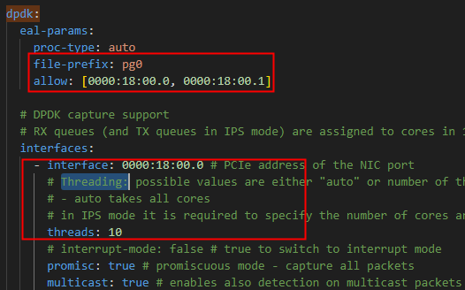

    2.  线程亲和性配置：

        -   set-cpu-affinity：是否设置线程亲和性。此处需配置yes，便于自行配置要使用的CPU核心，不然会默认使用所有CPU核心。
        -   management-cpu-set：Suricata管理线程绑定的核心。
        -   worker-cpu-set：Suricata工作线程绑定的核心。此处配置的核心数必须大于等于DPDK配置中，各网卡端口设置的线程数之和，确保每个线程绑定到单独的核心上。另外，工作线程不能包含管理线程。

        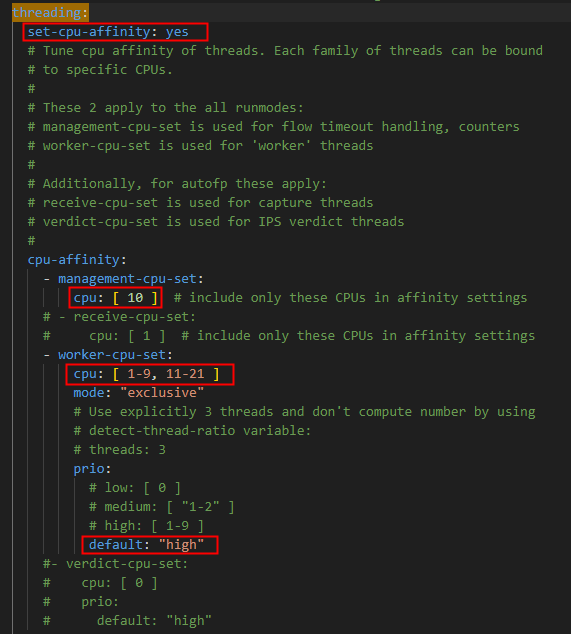

    3.  flow配置：

        -   memcap：管理流表使用的内存大小。
        -   hash-size：设置流表哈希表的大小。
        -   prealloc：初始化的时候预设置的流表。

        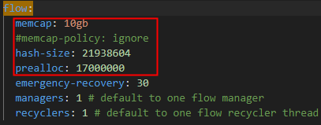

    4.  IP分片重组：

        -   memcap：碎片流表可以使用的内存。
        -   hash-size：碎片流表（哈希表）的大小。
        -   trackers：一个流能跟踪的分片数量。
        -   max-frags：大于等于trackers。

        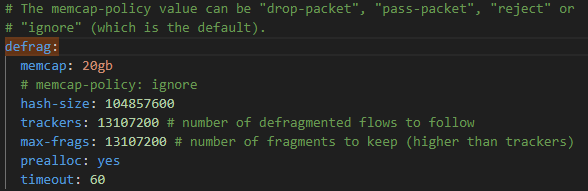

    5.  规则文件配置：

        -   default-rule-path：规则文件需放在该目录下。
        -   rule-files：指定使用的规则文件，规则文件必须存在，否则会启动失败。

        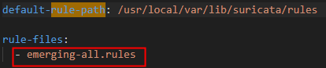

    6.  日志管理：

        打印eve-log会损耗大量性能，建议关闭。

        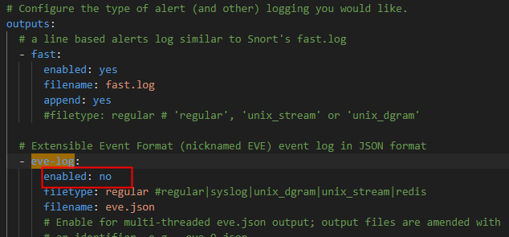


### 压力机配置<a name="ZH-CN_TOPIC_0000002249802882"></a>

在运行pktgen-dpdk进行发包之前，需要提前进行相关配置。

#### 大页内存配置<a name="section187351543718"></a>

使用DPDK需要配置大页内存。

1.  检查OS页表大小，配置大页内存。

    ```
    getconf PAGESIZE
    ```

    4K页表推荐配置1G大页内存，由于案例中使用的流量包wangan\_A.pcap需要占用约8.5G大页内存，即使用的每个网卡端口都需要使用约9G大页内存。而案例中网卡端口分别在NUMA0上分布了6个，NUMA1上分布了6个。此案例中NUMA0和NUMA1上各自都需要分配至少54G的大页内存，用户可根据实际情况调整大页内存配置。

    在“/boot/efi/EFI/openEuler/grub.cfg“中添加以下内容，保存后重启生效。该配置会设置144个1G的大页内存，并均分在各个NUMA上。

    ```
    default_hugepagesz=1G hugepagesz=1G hugepages=144 iommu.passthrough=1 
    ```

    

2.  重启后检查大页内存配置是否生效。

    ```
    dpdk-hugepages.py -s
    ```

    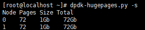


### 单核测试场景<a name="ZH-CN_TOPIC_0000002237188888"></a>

以下为使用suricata-dpdk进行收包解析的一个实际测试场景（单核），提供了相关命令供参考。

1.  <a name="li16263431193718"></a>网卡纳管DPDK驱动。

    CX5网卡可以直接忽略，SP680网卡需要纳管vfio-pci驱动才能被DPDK使用，执行以下命令将网卡端口绑定驱动，测试机与压力机均需执行此操作。

    ```
    modprobe vfio-pci
    dpdk-devbind.py -b=vfio-pci 0000:41:00.0 0000:41:00.1 0000:41:00.2 0000:41:00.3
    ```

    > **说明：** 
    >0000:41:00.0 0000:41:00.1 0000:41:00.2 0000:41:00.3为网卡端口的PCIe地址，请根据实际情况进行替换。

2.  查看网卡端口所在的NUMA节点。

    ```
    lspci -s 0000:41:00.0 -v
    ```

    如图所示网卡端口在NUMA1上。

    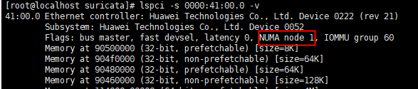

3.  <a name="li4161981157"></a>通过**lscpu**查看核心的NUMA分布，该网卡端口性能最佳是绑定NUMA1上的核心（32-63核），其次是NUMA0-NUMA1性能相差不大（0-63核）。尽量避免绑NUMA2和NUMA3上的核心，跨片绑核会使性能降低。

    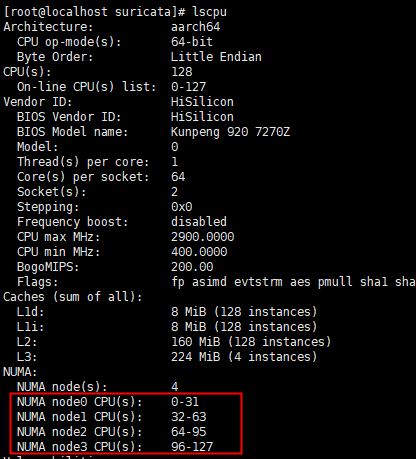

4.  <a name="li41893344419"></a>测试机启动Suricata。
    1.  按[测试机配置-3.Suricata配置](#li16263431193822)指导配置suricata.yaml，其中，DPDK和线程亲和性参照[图1](#fig48391418558)和[图2 线程亲和性配置参考](#fig93885515513)配置：
        1.  DPDK配置：指定使用的网卡端口，41:00.0是网卡端口的PCIe地址，用户需根据实际情况替换；指定使用线程数，一个线程绑定一个核，因此单线程即使用单核。

            **图 1**  DPDK配置参考<a name="fig48391418558"></a>  
            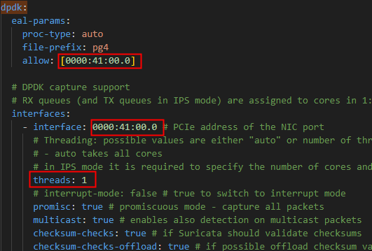

        2.  线程亲和性配置：按照上述[3](#li4161981157)中的分析，使用NUMA1上的核心最佳，指定使用NUAMA1上的48核作为管理线程的核心，40核作为工作线程的核心，用户可根据实际情况进行替换。

            **图 2**  线程亲和性配置参考<a name="fig93885515513"></a>  
            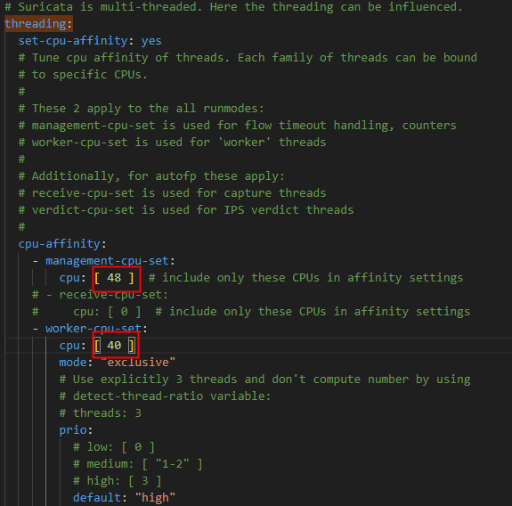

    2.  执行以下命令启动Suricata进程，并将日志输出到“output“目录中。本案例绑定的核心都在NUMA1上，可使用**taskset -c 32-63**指定进程在NUMA1的核心上运行。

        ```
        mkdir output
        export LD_LIBRARY_PATH=/usr/local/lib:$LD_LIBRARY_PATH
        taskset -c 32-63 suricata -c suricata.yaml --dpdk -l ./output -vvv
        ```

        出现以下日志即为启动成功。

        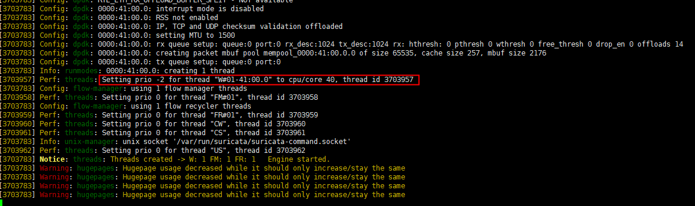

5.  压力机启动pktgen-dpdk发包。
    1.  网卡纳管DPDK驱动，参照[1](#li16263431193718)，用户需替换实际的PCIe地址。

        ```
        dpdk-devbind.py -b=vfio-pci 01:00.0 01:00.1 01:00.2 01:00.3
        ```

    2.  启动命令启动pktgen-dpdk。

        ```
        export LD_LIBRARY_PATH=/usr/local/lib64
        pktgen  -n 4 --proc-type auto --file-prefix pg1 -a 0000:01:00.0 -a 0000:01:00.1 -a 0000:01:00.2  -a 0000:01:00.3 -- -P -m "[2:3].0,[4:5].1,[6:7].2,[8:9].3" -s 0:/home/wangan_A.pcap -s 1:/home/wangan_A.pcap -s 2:/home/wangan_A.pcap -s 3:/home/wangan_A.pcap
        ```

        > **说明：** 
        >-   file-prefix：启动多个pktgen-dpdk进程时，每个进程需设置不同的值。
        >-   -a：白名单，控制DPDK占用的网卡端口。
        >-   \[2:3\].0 ： 2为收包核心，3为发包核心，用于设备0（网卡端口0）的收发包。此处需注意，需要绑定网卡numa亲和的核心，否则会导致coredump。
        >-   /home/wangan\_A.pcap：发包使用的流量包pcap文件，每个设备都需用-s单独指定；用户使用的流量，需根据实际业务场景准备。

    3.  执行发包。Pktgen启动成功后进入如下界面。

        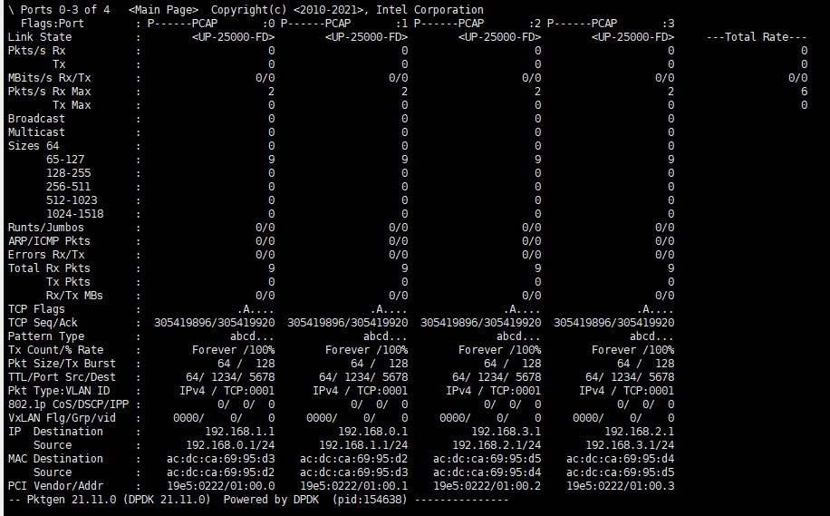

        可以使用以下命令控制发包，需要使用直连测试机网卡端口的压力机网卡端口进行发包，如用户不确定是哪个端口，可直接**start all**启动所有端口发包。

        ```
        start all  #启动全部网卡端口发包
        start 0    #启动网卡端口0发包
        stop all / stop 0  #停止全部网卡端口/网卡端口0发包
        page main  #展示pktgen主界面
        quit       #退出pktgen
        ```

        启动发包后，正常速率应达到网卡上限，如25GE的网卡端口，应能达到25000MBits/s左右。

        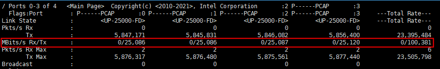

6.  测试机观察性能数据。

    回到测试机，进入[4](#li41893344419)启动命令中指定的“output“目录，执行以下命令，会持续输出当前性能数据。

    ```
    cd output
    tail -f stats.log
    ```

    结果如下图，红框中左侧为除去帧头等数据后，每秒数据处理量；右侧为网卡每秒接收并处理的数据量。结果记录以右侧数据为准。

    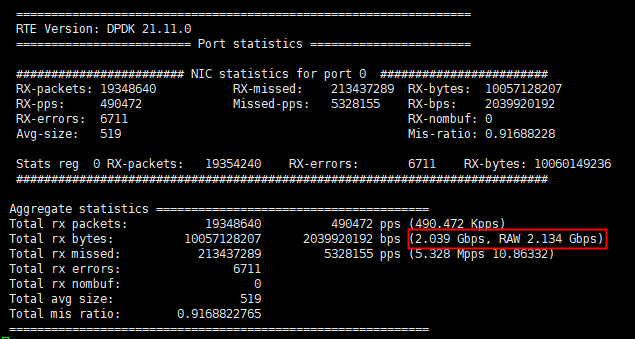


### 整机测试场景<a name="ZH-CN_TOPIC_0000002284859661"></a>

在整机测试的情况下，有几个特殊的瓶颈。

1.  单个Suricata进程设置的线程数过多，性能会遇到某个阈值，以920新型号服务器为例，阈值是80线程120Gbps，此后设置更多的线程数，性能会不升反降。推测是由于工作线程过多锁竞争严重、管理线程压力过大导致。
2.  单个网卡端口能设置的线程数也有上限，同样以920新型号服务器为例，单线程的性能大约在2.2-2.3Gbps，而单个网卡端口的传输速率最大是25Gbps，因此排除线性衰减的情况下，12个线程就达到网卡带宽上限了，此时网卡反而成了瓶颈。因此单个网卡端口设置的线程数也不能过多。
3.  当网卡跨片绑核时，性能也会出现衰减。

基于以上几点问题，案例中整机测试采用以下策略：

1.  运行多个Suricata进程，跑满920新型号服务器的128个核心。
2.  网卡的插法按CPU平均分配：NUMA1和NUMA3上各6个网卡端口。线程数按网卡端口均匀分配：CPU0上的网卡，只绑定CUP0上的核心，CPU1上的网卡同理。

案例中的测试用例是启用了4个Suricata进程，每个网卡单独一个进程，总计128核，12个网卡端口，每个端口分配约10核。

案例中的线程分配及测试数据如下，供参考。

<a name="table9929531471"></a>
<table><tbody><tr id="row711095319711"><td class="cellrowborder" rowspan="2" colspan="2" valign="top"><p id="p411014536713"><a name="p411014536713"></a><a name="p411014536713"></a>Kunpeng 920 7270Z</p>
</td>
<td class="cellrowborder" colspan="3" valign="top"><p id="p15110953273"><a name="p15110953273"></a><a name="p15110953273"></a>网卡<span id="ph870682615502"><a name="ph870682615502"></a><a name="ph870682615502"></a>A</span>（CX5）- NUMA 1</p>
</td>
<td class="cellrowborder" colspan="3" valign="top"><p id="p811065316715"><a name="p811065316715"></a><a name="p811065316715"></a>网卡<span id="ph129135334507"><a name="ph129135334507"></a><a name="ph129135334507"></a>B</span>（SP680）- NUMA 1</p>
</td>
<td class="cellrowborder" colspan="3" valign="top"><p id="p811013535711"><a name="p811013535711"></a><a name="p811013535711"></a>网卡C（CX5）- NUMA 3</p>
</td>
<td class="cellrowborder" colspan="3" valign="top"><p id="p611019531571"><a name="p611019531571"></a><a name="p611019531571"></a>网卡D（SP680) - NUMA 3</p>
</td>
<td class="cellrowborder" valign="top"><p id="p21102536714"><a name="p21102536714"></a><a name="p21102536714"></a>整机性能</p>
<p id="p1487620615918"><a name="p1487620615918"></a><a name="p1487620615918"></a>（Gbps）</p>
</td>
</tr>
<tr id="row151106538718"><td class="cellrowborder" valign="top"><p id="p9110253076"><a name="p9110253076"></a><a name="p9110253076"></a>FM（管理线程绑定的核心）</p>
</td>
<td class="cellrowborder" valign="top"><p id="p20110553275"><a name="p20110553275"></a><a name="p20110553275"></a>W（工作线程绑定的核心）</p>
</td>
<td class="cellrowborder" valign="top"><p id="p51104532711"><a name="p51104532711"></a><a name="p51104532711"></a>性能（领先HG7490幅度）</p>
</td>
<td class="cellrowborder" valign="top"><p id="p1611017531173"><a name="p1611017531173"></a><a name="p1611017531173"></a>FM（管理线程绑定的核心）</p>
</td>
<td class="cellrowborder" valign="top"><p id="p511018530719"><a name="p511018530719"></a><a name="p511018530719"></a>W（工作线程绑定的核心）</p>
</td>
<td class="cellrowborder" valign="top"><p id="p131104539716"><a name="p131104539716"></a><a name="p131104539716"></a>性能（领先HG7490幅度）</p>
</td>
<td class="cellrowborder" valign="top"><p id="p201102531277"><a name="p201102531277"></a><a name="p201102531277"></a>FM</p>
</td>
<td class="cellrowborder" valign="top"><p id="p11110195310715"><a name="p11110195310715"></a><a name="p11110195310715"></a>W</p>
</td>
<td class="cellrowborder" valign="top"><p id="p4110453771"><a name="p4110453771"></a><a name="p4110453771"></a>性能（Gbps）</p>
</td>
<td class="cellrowborder" valign="top"><p id="p111065312710"><a name="p111065312710"></a><a name="p111065312710"></a>FM</p>
</td>
<td class="cellrowborder" valign="top"><p id="p1611075310715"><a name="p1611075310715"></a><a name="p1611075310715"></a>W</p>
</td>
<td class="cellrowborder" valign="top"><p id="p811013536714"><a name="p811013536714"></a><a name="p811013536714"></a>性能（领先HG7490幅度）</p>
</td>
<td class="cellrowborder" valign="top">&nbsp;&nbsp;</td>
</tr>
<tr id="row1911065315716"><td class="cellrowborder" rowspan="2" valign="top" width="6.666666666666667%"><p id="p1611035315719"><a name="p1611035315719"></a><a name="p1611035315719"></a>非超线程</p>
</td>
<td class="cellrowborder" valign="top" width="6.666666666666667%"><p id="p14110753478"><a name="p14110753478"></a><a name="p14110753478"></a>单核</p>
</td>
<td class="cellrowborder" valign="top" width="6.666666666666667%"><p id="p111065319711"><a name="p111065319711"></a><a name="p111065319711"></a>48</p>
</td>
<td class="cellrowborder" valign="top" width="6.666666666666667%"><p id="p611015316715"><a name="p611015316715"></a><a name="p611015316715"></a>40</p>
</td>
<td class="cellrowborder" valign="top" width="6.666666666666667%"><p id="p11110145313713"><a name="p11110145313713"></a><a name="p11110145313713"></a><span id="ph189842220515"><a name="ph189842220515"></a><a name="ph189842220515"></a>28%</span></p>
</td>
<td class="cellrowborder" valign="top" width="6.666666666666667%"><p id="p13110125310719"><a name="p13110125310719"></a><a name="p13110125310719"></a>48</p>
</td>
<td class="cellrowborder" valign="top" width="6.6566716641679164%"><p id="p611019531717"><a name="p611019531717"></a><a name="p611019531717"></a>40</p>
</td>
<td class="cellrowborder" valign="top" width="6.6766616691654175%"><p id="p55151285115"><a name="p55151285115"></a><a name="p55151285115"></a>27.6%</p>
</td>
<td class="cellrowborder" valign="top" width="6.666666666666667%"><p id="p9110453172"><a name="p9110453172"></a><a name="p9110453172"></a>112</p>
</td>
<td class="cellrowborder" valign="top" width="6.666666666666667%"><p id="p81104531579"><a name="p81104531579"></a><a name="p81104531579"></a>104</p>
</td>
<td class="cellrowborder" valign="top" width="6.666666666666667%"><p id="p16785122310519"><a name="p16785122310519"></a><a name="p16785122310519"></a>29.6%</p>
</td>
<td class="cellrowborder" valign="top" width="6.666666666666667%"><p id="p51102531174"><a name="p51102531174"></a><a name="p51102531174"></a>112</p>
</td>
<td class="cellrowborder" valign="top" width="6.666666666666667%"><p id="p16110135319720"><a name="p16110135319720"></a><a name="p16110135319720"></a>104</p>
</td>
<td class="cellrowborder" valign="top" width="6.666666666666667%"><p id="p467113275119"><a name="p467113275119"></a><a name="p467113275119"></a>26.3%</p>
</td>
<td class="cellrowborder" valign="top" width="6.666666666666667%">&nbsp;&nbsp;</td>
</tr>
<tr id="row1311075317720"><td class="cellrowborder" valign="top"><p id="p411055317716"><a name="p411055317716"></a><a name="p411055317716"></a>多核</p>
</td>
<td class="cellrowborder" valign="top"><p id="p211018535715"><a name="p211018535715"></a><a name="p211018535715"></a>10</p>
</td>
<td class="cellrowborder" valign="top"><p id="p141101953273"><a name="p141101953273"></a><a name="p141101953273"></a>1-21</p>
</td>
<td class="cellrowborder" valign="top"><p id="p151102531774"><a name="p151102531774"></a><a name="p151102531774"></a><span id="ph1543344355111"><a name="ph1543344355111"></a><a name="ph1543344355111"></a>16.6%</span></p>
</td>
<td class="cellrowborder" valign="top"><p id="p191101453277"><a name="p191101453277"></a><a name="p191101453277"></a>40</p>
</td>
<td class="cellrowborder" valign="top"><p id="p911120537718"><a name="p911120537718"></a><a name="p911120537718"></a>22-63</p>
</td>
<td class="cellrowborder" valign="top"><p id="p1811114531878"><a name="p1811114531878"></a><a name="p1811114531878"></a><span id="ph1952965017513"><a name="ph1952965017513"></a><a name="ph1952965017513"></a>36.8%</span></p>
</td>
<td class="cellrowborder" valign="top"><p id="p191111653377"><a name="p191111653377"></a><a name="p191111653377"></a>74</p>
</td>
<td class="cellrowborder" valign="top"><p id="p4111135312714"><a name="p4111135312714"></a><a name="p4111135312714"></a>64 - 84</p>
</td>
<td class="cellrowborder" valign="top"><p id="p1010145720517"><a name="p1010145720517"></a><a name="p1010145720517"></a>15%</p>
</td>
<td class="cellrowborder" valign="top"><p id="p1011155319718"><a name="p1011155319718"></a><a name="p1011155319718"></a>106</p>
</td>
<td class="cellrowborder" valign="top"><p id="p611117534718"><a name="p611117534718"></a><a name="p611117534718"></a>85-127</p>
</td>
<td class="cellrowborder" valign="top"><p id="p151110531677"><a name="p151110531677"></a><a name="p151110531677"></a><span id="ph68271335214"><a name="ph68271335214"></a><a name="ph68271335214"></a>29.2%</span></p>
</td>
<td class="cellrowborder" valign="top"><p id="p411195312712"><a name="p411195312712"></a><a name="p411195312712"></a><span id="ph76361240125213"><a name="ph76361240125213"></a><a name="ph76361240125213"></a>26.8%</span></p>
</td>
</tr>
</tbody>
</table>

测试命令如下，供参考。

```
# 测试机，启用多个会话，使用不同的suricata.yaml和output输出目录
export LD_LIBRARY_PATH=/usr/local/lib:$LD_LIBRARY_PATH
taskset -c 1-31 suricata -c suricata.yaml --dpdk -l ./output -vvv
taskset -c 1-63 suricata -c suricata1.yaml --dpdk -l ./output1 -vvv
taskset -c 64-95 suricata -c suricata2.yaml --dpdk -l ./output2 -vvv
taskset -c 64-127 suricata -c suricata3.yaml --dpdk -l ./output3 -vvv

# 压力机，同样启用多个会话，用三个进程发包
pktgen  -n 4 --proc-type auto --file-prefix pg1 -a 0000:01:00.0 -a 0000:01:00.1 -a 0000:01:00.2  -a 0000:01:00.3 -- -P -m "[2:3].0,[4:5].1,[6:7].2,[8:9].3" -s 0:/home/wangan_A.pcap -s 1:/home/wangan_A.pcap -s 2:/home/wangan_A.pcap -s 3:/home/wangan_A.pcap

pktgen -n 4 --proc-type auto --file-prefix pg2 -a 0000:03:00.0 -a 0000:03:00.1 -a 0000:03:00.2 -a 0000:03:00.3 -- -P -m "[42:43].0,[44:45].1,[46:47].2,[48:49].3" -s 0:/home/wangan_A.pcap -s 1:/home/wangan_A.pcap -s 2:/home/wangan_A.pcap -s 3:/home/wangan_A.pcap

pktgen -n 4 --proc-type auto --file-prefix pg4 -a 0000:87:00.0 -a 0000:87:00.1  -a 0000:87:00.2 -a 0000:87:00.3 --   -P -m "[82:83].0,[84:85].1,[86:87].2,[88:89].3" -s 0:/home/wangan_A.pcap -s 1:/home/wangan_A.pcap -s 2:/home/wangan_A.pcap -s 3:/home/wangan_A.pcap
```
